# DRL-Pacman

DRL-Pacman là project thực nghiệm Reinforcement Learning trên môi trường Mini Pacman, dùng để huấn luyện và so sánh `Q-learning`, `DQN` và `Double DQN` trên cùng một môi trường, cùng lịch train và cùng quy trình đánh giá.

Repo này đã có đầy đủ workflow cho một project hoàn chỉnh: cấu hình bằng YAML, checkpoint/resume, final model, evaluation metrics, biểu đồ so sánh, GUI xem agent chơi và GIF demo có thể tái tạo.

## Kết Quả Final Evaluation

Toàn bộ `9` run đã train tới `20000` episodes:

```text
3 thuật toán x 3 learning rate = 9 runs
learning rates: 0.0001, 0.0005, 0.001
evaluation: 20 episodes mỗi run tại episode 20000
```

Bảng dưới đây phản ánh hiệu năng của model sau khi train xong. Cột `Win rate` là tỉ lệ thắng trong `20` trận evaluation cuối tại episode `20000`, không phải win rate trung bình trên toàn bộ quá trình train.

| Algorithm | LR | Avg reward | Avg completion | Win rate | Avg steps | Best completion |
|---|---:|---:|---:|---:|---:|---:|
| Double DQN | 0.0001 | 1247.154 | 99.76% | 95% | 148.30 | 100% |
| Double DQN | 0.0005 | 1312.231 | 99.27% | 85% | 153.60 | 100% |
| Double DQN | 0.001 | 1553.422 | 99.27% | 65% | 211.65 | 100% |
| DQN | 0.0001 | 1125.694 | 98.55% | 75% | 157.85 | 100% |
| DQN | 0.0005 | 1254.443 | 99.84% | 95% | 138.90 | 100% |
| DQN | 0.001 | 1148.294 | 98.71% | 75% | 161.85 | 100% |
| Q-learning | 0.0001 | 61.960 | 26.29% | 0% | 99.25 | 51.61% |
| Q-learning | 0.0005 | 134.079 | 42.66% | 0% | 124.05 | 51.61% |
| Q-learning | 0.001 | 165.472 | 46.29% | 0% | 134.40 | 54.84% |

Nhận xét chính:

- `DQN` và `Double DQN` vượt trội rõ rệt so với `Q-learning` trên map hiện tại.
- `DQN lr=0.0005` và `Double DQN lr=0.0001` đạt win rate cuối tốt nhất: `95%`.
- `Double DQN lr=0.001` có avg reward cao nhất, nhưng win rate kém ổn định hơn hai run tốt nhất.
- `Q-learning` có completion tăng khi learning rate cao hơn, nhưng chưa clear map ổn định.

## Demo

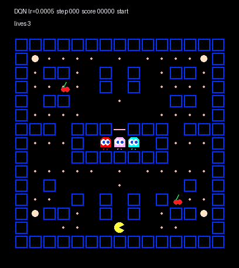

Chạy GUI để xem model trực tiếp:

```powershell
python -m src.training.watch_finals
```

Tạo lại GIF demo:

```powershell
python -m src.training.render_demo_gif
```

## Cài Đặt Nhanh

Tạo môi trường conda:

```powershell
conda create -n pacman python=3.10 -y
conda activate pacman
pip install -r requirements.txt
```

Kiểm tra trạng thái thí nghiệm:

```powershell
python run_all_experiments.py --all-lr --status
```

Vẽ lại biểu đồ:

```powershell
python -m src.training.compare_runs
```

Mở viewer xem model:

```powershell
python -m src.training.watch_finals
```

## Cấu Trúc Project

```text
DRL-Pacman/
|-- configs/                 # YAML config cho từng thuật toán và learning rate
|-- docs/assets/             # GIF demo trong README
|-- experiments/
|   |-- metrics/             # CSV train/eval metrics
|   |-- history/             # JSONL lịch sử các lần train
|   `-- plots/               # Biểu đồ kết quả được track lên GitHub
|-- models/
|   |-- final/               # Final model được track lên GitHub
|   `-- checkpoints/         # Checkpoint định kỳ, không track
|-- scripts/                 # Script PowerShell theo learning rate
|-- src/
|   |-- algorithms/          # Q-learning, DQN, Double DQN
|   |-- pacman_env/          # MiniPacmanEnv
|   `-- training/            # Train, evaluate, plot, watch, render GIF
|-- tests/
|-- requirements.txt
`-- run_all_experiments.py
```

## Thiết Lập Thí Nghiệm

Mỗi thuật toán được train với 3 learning rate:

```text
0.0001 -> *_lr_0001.yaml
0.0005 -> *_lr_0005.yaml
0.001  -> *_lr_001.yaml
```

Danh sách config:

```text
configs/q_learning/q_learning_lr_0001.yaml
configs/q_learning/q_learning_lr_0005.yaml
configs/q_learning/q_learning_lr_001.yaml
configs/dqn/dqn_lr_0001.yaml
configs/dqn/dqn_lr_0005.yaml
configs/dqn/dqn_lr_001.yaml
configs/double_dqn/double_dqn_lr_0001.yaml
configs/double_dqn/double_dqn_lr_0005.yaml
configs/double_dqn/double_dqn_lr_001.yaml
```

Chạy toàn bộ thí nghiệm:

```powershell
python run_all_experiments.py --all-lr
```

Chỉ chạy các run còn thiếu hoặc chưa hoàn thành:

```powershell
python run_all_experiments.py --all-lr --auto-resume
```

Chạy một nhóm learning rate:

```powershell
.\scripts\run_lr_0001.ps1
.\scripts\run_lr_0005.ps1
.\scripts\run_lr_001.ps1
```

Chạy thủ công từng thuật toán:

```powershell
python -m src.training.train_q_learning --config configs/q_learning/q_learning_lr_0005.yaml
python -m src.training.train_dqn --config configs/dqn/dqn_lr_0005.yaml
python -m src.training.train_double_dqn --config configs/double_dqn/double_dqn_lr_0005.yaml
```

Resume thủ công:

```powershell
python -m src.training.train_dqn --config configs/dqn/dqn_lr_0005.yaml --resume
```

## Biểu Đồ

`compare_runs.py` đọc metrics từ `experiments/metrics/` và ghi biểu đồ vào `experiments/plots/` theo format:

```text
<metric>_<lr>.png
```

Ví dụ:

```text
reward_0005.png
completion_0005.png
loss_0005.png
```

Tạo toàn bộ biểu đồ mặc định:

```powershell
python -m src.training.compare_runs
```

Chỉ vẽ một vài metric:

```powershell
python -m src.training.compare_runs --metrics reward completion
```

Vẽ biểu đồ từ eval metrics:

```powershell
python -m src.training.compare_runs --source eval
```

Các biểu đồ kết quả:

### Reward

| LR 0.0001 | LR 0.0005 | LR 0.001 |
|---|---|---|
| 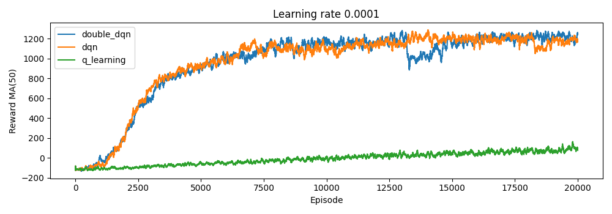 | 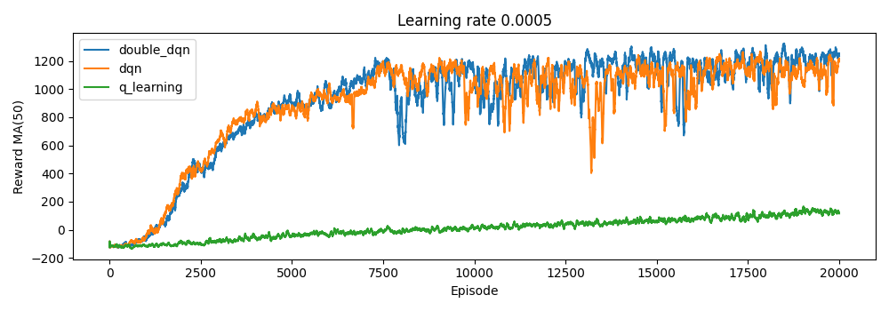 | 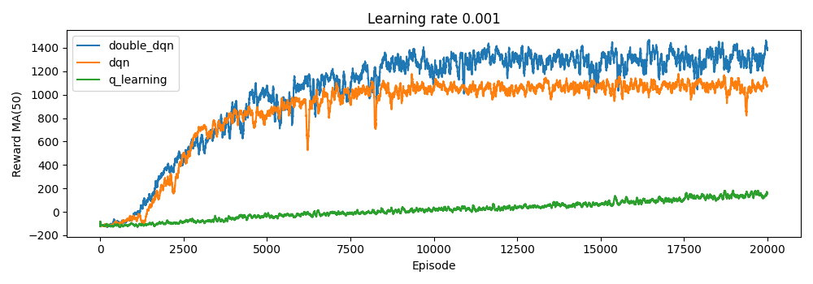 |

### Completion Rate

| LR 0.0001 | LR 0.0005 | LR 0.001 |
|---|---|---|
| 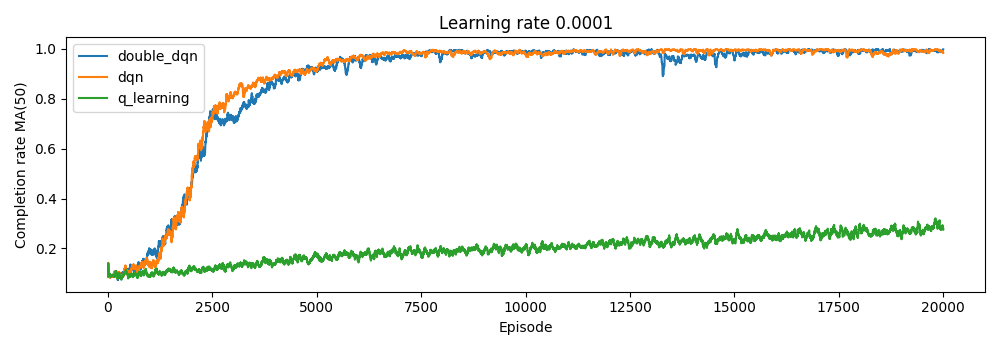 | 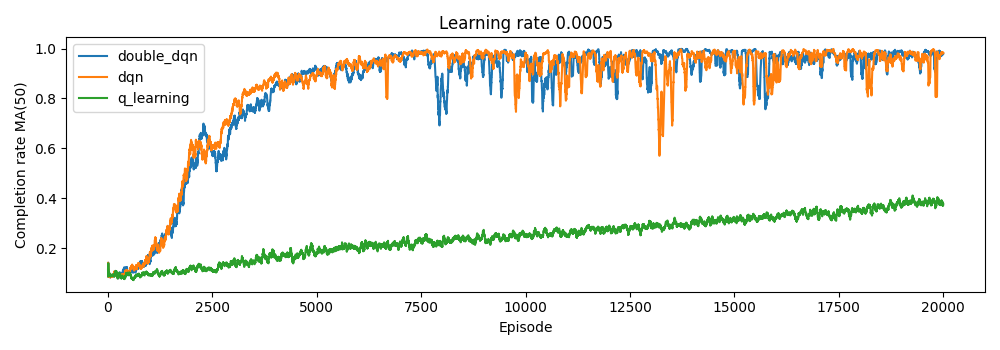 | 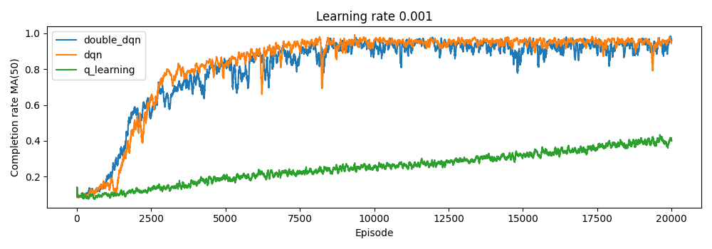 |

### Win Rate

| LR 0.0001 | LR 0.0005 | LR 0.001 |
|---|---|---|
| 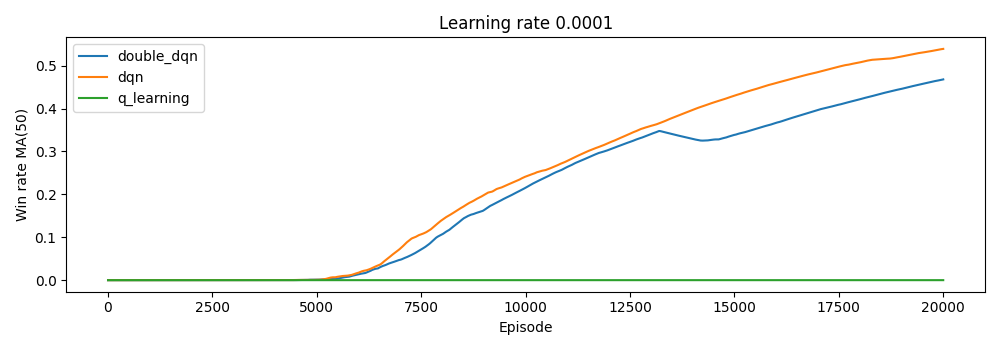 | 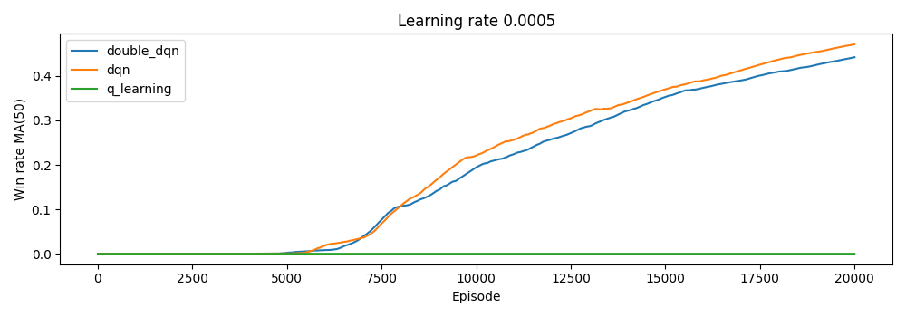 | 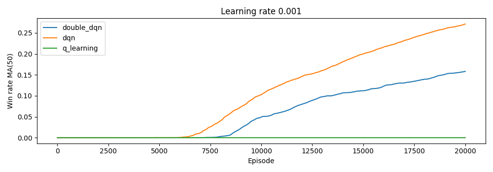 |

### Steps

| LR 0.0001 | LR 0.0005 | LR 0.001 |
|---|---|---|
| 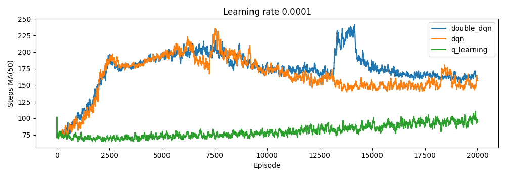 | 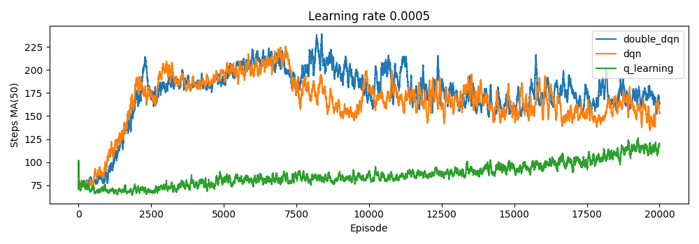 | 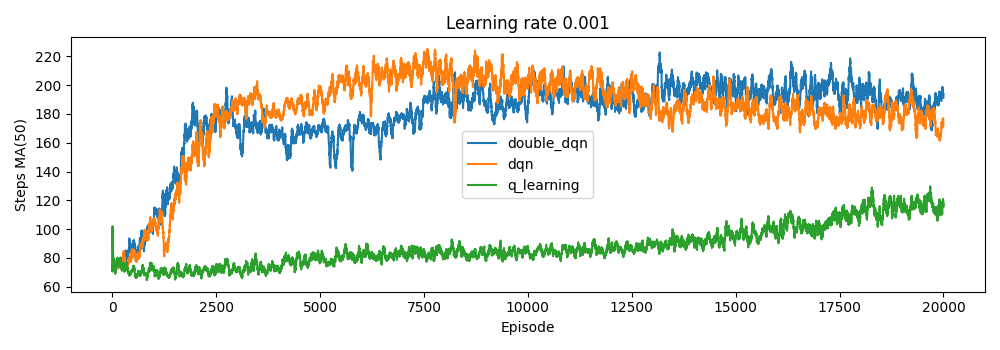 |

### Loss

`loss` chỉ áp dụng cho `DQN` và `Double DQN`, vì `Q-learning` không có neural network loss.

| LR 0.0001 | LR 0.0005 | LR 0.001 |
|---|---|---|
| 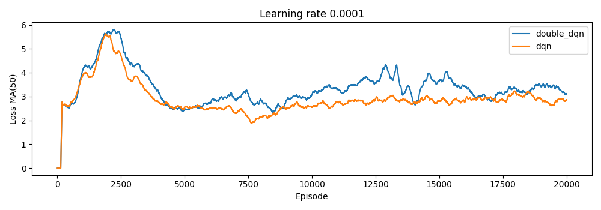 | 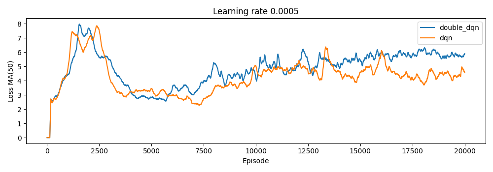 | 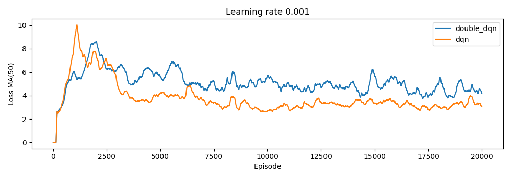 |

## Xem Model Chơi

Liệt kê final model:

```powershell
python -m src.training.watch_finals --list
```

Mở menu chọn model:

```powershell
python -m src.training.watch_finals
```

Xem một thuật toán:

```powershell
python -m src.training.watch_finals --algorithm dqn
```

Xem một config cụ thể:

```powershell
python -m src.training.watch_model --config configs/dqn/dqn_lr_0005.yaml
```

Ưu tiên checkpoint mới nhất thay vì final model:

```powershell
python -m src.training.watch_model --config configs/dqn/dqn_lr_0005.yaml --prefer-checkpoint
```


## Kiểm Tra

Chạy test:

```powershell
pytest
```

Kiểm tra cú pháp các script chính:

```powershell
python -m py_compile run_all_experiments.py src/training/watch_model.py src/training/watch_finals.py src/training/compare_runs.py src/training/render_demo_gif.py
```

## Ghi Chú

- `loss` chỉ có ý nghĩa với `DQN` và `Double DQN`.
- Khi agent chưa clear map ổn định, `reward` và `completion` thường hữu ích hơn `win_rate`.
- `steps` giúp phân biệt agent sống lâu thật sự với agent chỉ ăn nhanh rồi chết sớm.
